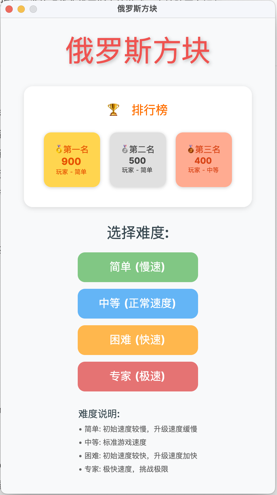
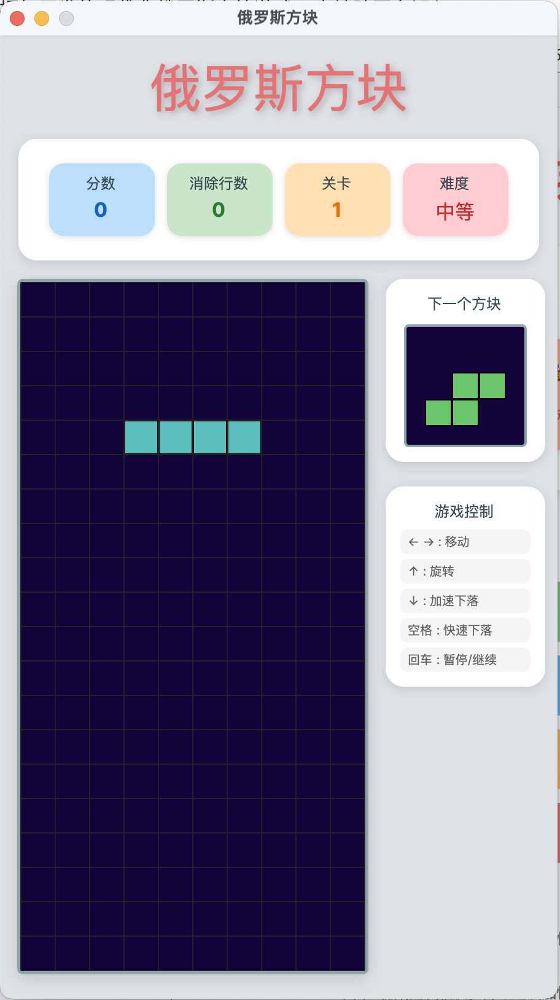

# 🎮 俄罗斯方块游戏 (Tetris Game)

一个使用 C# 和 Avalonia UI 框架开发的现代化俄罗斯方块游戏，支持跨平台运行，具备完整的音效系统和用户友好的界面。



## 🎮 游戏特性

### 核心功能
- **经典俄罗斯方块玩法**：7种不同形状的方块（I、O、T、S、Z、J、L）
- **多难度选择**：简单、中等、困难三个难度级别
- **实时计分系统**：根据消除行数和难度计算得分
- **等级系统**：随着游戏进行自动提升等级和速度
- **排行榜功能**：记录和显示历史最高分

### 音效系统
- **背景音乐**：游戏过程中的循环背景音乐，支持暂停/恢复
- **丰富的音效反馈**：
  - 按钮点击音效
  - 方块移动音效
  - 方块旋转音效
  - 方块快速下落音效
  - 消除行音效
  - 游戏结束音效
- **智能音频管理**：
  - 自动资源清理，防止内存泄漏
  - 进程退出时完全停止音频播放
  - 跨平台音频支持（macOS、Windows、Linux）
  - Windows 平台优化的音频播放机制

### 用户界面
- **现代化界面**：使用 Avalonia UI 构建的美观界面
- **响应式设计**：适配不同屏幕尺寸
- **实时信息显示**：当前得分、等级、难度、下一个方块预览
- **游戏暂停功能**：支持游戏暂停和继续

## 🛠️ 技术栈

- **框架**：.NET 8.0
- **UI 框架**：Avalonia UI
- **编程语言**：C#
- **音频处理**：跨平台系统音频调用
- **数据存储**：JSON 文件存储排行榜数据

## 📁 项目结构

```
TetrisGame/
├── Controllers/           # 游戏控制器
│   └── GameController.cs  # 主游戏逻辑控制
├── Models/               # 数据模型
│   ├── AudioManager.cs   # 音频管理器（支持跨平台音频播放）
│   ├── GameBoard.cs      # 游戏板逻辑
│   ├── LeaderboardManager.cs # 排行榜管理
│   ├── Block.cs          # 方块基类
│   ├── BlockFactory.cs   # 方块工厂
│   └── [各种方块类型]     # IBlock, JBlock, LBlock, OBlock, SBlock, TBlock, ZBlock, PBlock
├── Views/                # 视图界面
│   ├── GameView.axaml    # 游戏界面
│   ├── GameView.axaml.cs # 游戏界面逻辑
│   ├── MenuView.axaml    # 菜单界面
│   └── MenuView.axaml.cs # 菜单界面逻辑
├── Assets/               # 静态资源
│   ├── tetris.ico        # Windows 应用图标
│   └── tetris.png        # macOS 应用图标
├── bgm/                  # 音频资源
│   ├── bgm.wav          # 背景音乐
│   ├── click.wav        # 点击音效
│   ├── move.wav         # 移动音效
│   ├── rotate.wav       # 旋转音效
│   ├── fall.wav         # 下落音效
│   ├── clear.wav        # 消除音效
│   └── gameover.wav     # 游戏结束音效
├── README.assets/        # README 图片资源
├── MainWindow.axaml      # 主窗口
├── App.axaml            # 应用程序入口
├── Program.cs           # 程序入口点
├── app.manifest         # Windows 应用清单
├── leaderboard.json     # 排行榜数据文件
├── build-windows-single-file.bat # Windows 构建脚本
├── build-windows-single-file.ps1 # Windows PowerShell 构建脚本
└── TetrisGame.csproj    # 项目配置文件
```

## 🚀 安装和运行

### 系统要求
- .NET 8.0 SDK 或更高版本
- 支持的操作系统：Windows 10+、macOS 10.15+、Linux（主流发行版）

### 安装步骤

1. **克隆项目**
   ```bash
   git clone <repository-url>
   cd TetrisGame
   ```

2. **还原依赖**
   ```bash
   dotnet restore
   ```

3. **编译项目**
   ```bash
   dotnet build
   ```

4. **运行游戏**
   ```bash
   dotnet run
   ```

### 发布版本

#### 标准发布
创建独立可执行文件：
```bash
# Windows
dotnet publish -c Release -r win-x64 --self-contained

# macOS
dotnet publish -c Release -r osx-x64 --self-contained

# Linux
dotnet publish -c Release -r linux-x64 --self-contained
```

#### 单文件发布（推荐）
创建单个可执行文件，便于分发：
```bash
# Windows 单文件
dotnet publish -c Release -r win-x64 --self-contained true -p:PublishSingleFile=true -p:PublishTrimmed=false -o ./publish/win-x64

# macOS 单文件
dotnet publish -c Release -r osx-x64 --self-contained true -p:PublishSingleFile=true -p:PublishTrimmed=false -o ./publish/osx-x64

# Linux 单文件
dotnet publish -c Release -r linux-x64 --self-contained true -p:PublishSingleFile=true -p:PublishTrimmed=false -o ./publish/linux-x64
```

#### 快速构建脚本
项目提供了便捷的构建脚本：
- **Windows**: 运行 `build-windows-single-file.bat` 或 `build-windows-single-file.ps1`
- **开发模式**: 运行 `run-dev.bat` (Windows) 或 `run-dev.sh` (macOS/Linux)

## 🎯 游戏操作

### 键盘控制
- **←/→ 方向键**：左右移动方块
- **↓ 方向键**：加速下落
- **↑ 方向键**：旋转方块
- **空格键**：瞬间下落到底部
- **Enter 键**：
  - 游戏中：暂停/继续
  - 游戏结束：返回主菜单

### 鼠标操作
- **点击难度按钮**：选择游戏难度
- **鼠标悬停**：按钮音效反馈

## 🏆 游戏规则

### 得分系统
- **单行消除**：100 × 难度系数 × 等级
- **多行消除**：额外奖励分数
- **难度系数**：简单(1.0)、中等(1.5)、困难(2.0)

### 等级提升
- 每消除一定行数自动提升等级
- 等级越高，方块下落速度越快
- 更高等级获得更多分数

### 游戏结束
- 当新方块无法放置在游戏区域顶部时游戏结束
- 自动保存最高分到排行榜

## 🔧 开发说明

### 架构设计
- **MVC 模式**：清晰的模型-视图-控制器分离
- **事件驱动**：使用事件处理游戏状态变化和用户交互
- **模块化设计**：音频、游戏逻辑、UI 完全分离
- **工厂模式**：使用 BlockFactory 创建不同类型的方块
- **单例模式**：AudioManager 和 LeaderboardManager 采用单例设计

### 音频系统架构
- **跨平台适配**：根据操作系统自动选择合适的音频播放器
  - Windows: `System.Media.SoundPlayer`
  - macOS: `afplay` 命令行工具
  - Linux: `paplay` 命令行工具
- **资源管理**：智能的临时文件管理和自动清理
- **异步处理**：音效播放不阻塞主线程
- **生命周期管理**：完善的应用程序退出处理

### 扩展功能
项目支持以下扩展：
- 添加新的方块类型（已预留 PBlock 等扩展方块）
- 自定义音效和音乐
- 新的游戏模式和难度设置
- 网络多人对战功能
- 自定义主题和皮肤系统
- 游戏录像和回放功能

### 代码质量
- **编码规范**：严格遵循 C# 编码规范和最佳实践
- **错误处理**：完整的异常处理和错误恢复机制
- **资源管理**：实现 IDisposable 接口，确保资源正确释放
- **跨平台兼容**：针对不同操作系统的特殊处理
- **性能优化**：
  - 音频播放优化，减少延迟
  - 内存管理优化，防止内存泄漏
  - UI 渲染优化，确保流畅的游戏体验
- **可维护性**：清晰的代码结构和充分的注释

## 🐛 故障排除

### 常见问题

1. **音频相关问题**
   - **音频无法播放**：
     - 确保系统音频驱动正常
     - 检查音频文件是否存在于 `bgm/` 目录
     - macOS 用户确保已安装 `afplay`
     - Linux 用户确保已安装 `paplay`
   - **Windows 音效延迟或丢失**：
     - 项目已优化 Windows 平台音频播放机制
     - 使用同步播放确保音效完整性
   - **游戏关闭后背景音乐仍在播放**：
     - 项目已修复此问题，增加了完善的资源清理机制
     - 支持多种退出方式的音频停止（正常关闭、强制退出、Ctrl+C）

2. **游戏运行问题**
   - **游戏无法启动**：
     - 确认 .NET 8.0 运行时已安装
     - 检查项目依赖是否正确还原
     - 在 macOS 上运行可能出现平台兼容性警告，这是正常的
   - **编译警告 CA1416**：
     - 这是平台特定 API 的警告，已在项目中禁用
     - 不影响程序正常运行

3. **数据存储问题**
   - **排行榜数据丢失**：
     - 检查 `leaderboard.json` 文件权限
     - 确保应用有写入当前目录的权限
     - 首次运行时会自动创建排行榜文件

4. **性能问题**
   - **游戏卡顿**：
     - 检查系统资源使用情况
     - 确保音频文件没有损坏
     - 尝试重启应用程序

## 📋 版本更新日志

### v1.2.0 (最新)
- ✅ **音频系统重大优化**：
  - 修复 Windows 平台音效延迟和丢失问题
  - 修复游戏关闭后背景音乐仍播放的问题
  - 优化跨平台音频播放机制
  - 增强应用程序生命周期管理
- ✅ **性能提升**：
  - 改进音频资源管理，防止内存泄漏
  - 优化临时文件清理机制
  - 增强错误处理和异常恢复
- ✅ **用户体验改进**：
  - 完善游戏暂停和恢复功能
  - 优化按键响应和音效反馈
  - 改进排行榜数据持久化

### v1.1.0
- 🎵 完整音效系统实现
- 🏆 排行榜功能
- 🎮 多难度选择
- 🖼️ 应用图标和界面优化

### v1.0.0
- 🎯 基础俄罗斯方块游戏功能
- 🎨 Avalonia UI 界面
- ⚡ 跨平台支持

## 🛠️ 技术特色

- **现代化 UI**：基于 Avalonia UI 的跨平台界面框架
- **高性能音频**：针对不同平台优化的音频播放系统
- **智能资源管理**：自动内存管理和资源清理
- **健壮的错误处理**：完善的异常处理和恢复机制
- **可扩展架构**：模块化设计，易于功能扩展

## 📄 许可证

本项目仅用于学习和教育目的。

## 🤝 贡献

欢迎提交 Issue 和 Pull Request 来改进这个项目！

### 贡献指南
1. Fork 本项目
2. 创建功能分支 (`git checkout -b feature/AmazingFeature`)
3. 提交更改 (`git commit -m 'Add some AmazingFeature'`)
4. 推送到分支 (`git push origin feature/AmazingFeature`)
5. 开启 Pull Request

## 🙏 致谢

- [Avalonia UI](https://avaloniaui.net/) - 优秀的跨平台 UI 框架
- [.NET](https://dotnet.microsoft.com/) - 强大的开发平台
- 所有为项目提供反馈和建议的用户

---

**享受游戏！** 🎮✨

*如果这个项目对你有帮助，请给个 ⭐ Star！*